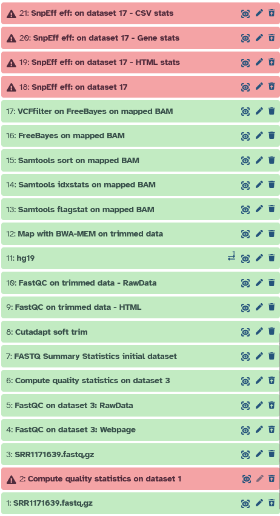
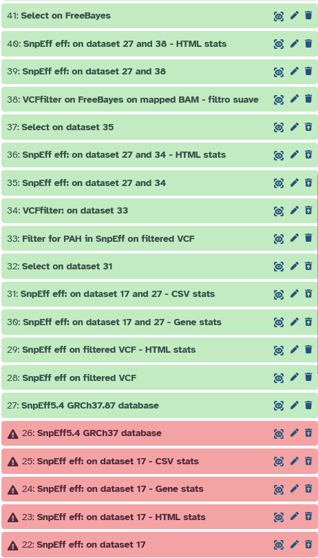
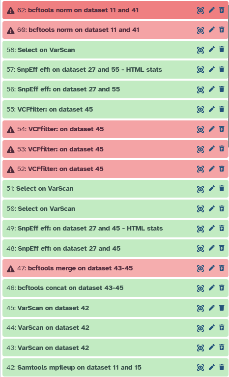

# Anexos

## AnexosI. Repositorio de Github
Github code: https://github.com/porvik/analisis-clinica-genomica-fenilcetonuria

Github pages: https://porvik.github.io/analisis-clinica-genomica-fenilcetonuria/

## Anexo II. Descarga de datasets iniciales
Los datos de secuenciación utilizados en este trabajo proceden de repositorios públicos.

La descarga puede realizarse desde la página de ENA del run seleccionado:

https://www.ebi.ac.uk/ena/browser/view/SRR1171639

En la página del run se pueden consultar los metadatos del experimento y acceder a los archivos disponibles, incluyendo los enlaces de descarga en formato FASTQ cuando están disponibles.

## Anexo III. Historial de Galaxy
El análisis se realizó en Galaxy y el historial con todos los parámetros se puede descargar desde [https://usegalaxy.org/u/porvik/h/analisis-clinico-genomico-viktor](https://usegalaxy.org/u/porvik/h/analisis-clinico-genomico-viktor) o en las capturas de pantalla abajo.

:::{table} Capturas de pantalla de Galaxy
:label: screens-galaxy
:align: center

|  |  |  | 
|----------------------------------|------------------------------------------|----------------------------|

:::